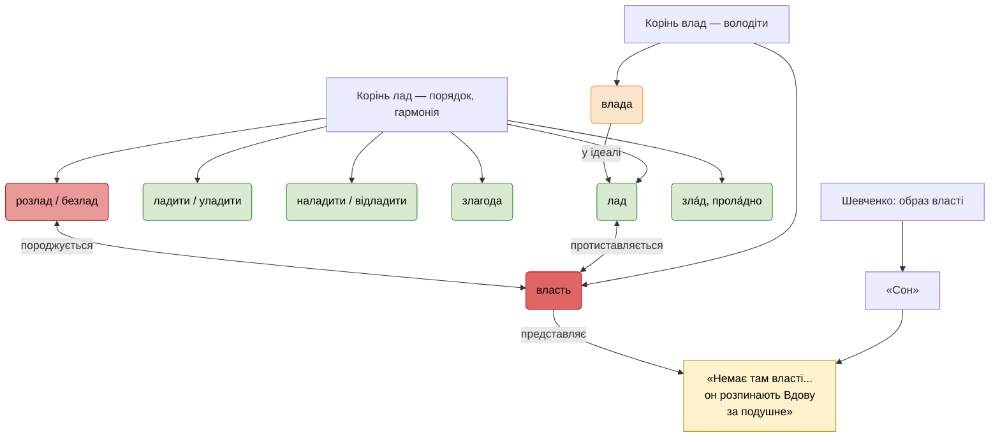

# 📚 **Слова з коренем «лад». Походження. Зв’язок з «владою» у світлі творів Шевченка**

---

## 🔤 Слова з коренем **«лад»** — повний список

Слова з коренем **«лад»** передають значення **порядку, гармонії, злагоди, внутрішньої та зовнішньої організації**. Вони мають глибоке мовне, побутове та філософське звучання.

### ✅ 1. Основні слова
| Слово | Частини мови | Значення |
|------|------------|---------|
| **лад** | іменник | порядок, злагода, гармонія (*Божий лад, в домі лад*) |
| **ладити** | дієслово | налагоджувати, бути в злагоді, діяти спільно |
| **злагода** | іменник | стан гармонії, узгодженості (від *з- + лад*) |
| **уладити** | дієслово | привести до ладу, вирішити, впорядкувати |
| **наладити** | дієслово | установити робочий лад, налагодити (техніку, стосунки) |
| **відладити** | дієслово | усунути несправності, добитися чіткої роботи (напр. коду) |
| **переладити** | дієслово | змінити налаштування, переорганізувати |
| **підладити** | дієслово | зробити невелику піднастройку, добитися ладу |
| **розладити** | дієслово | порушити лад, зіпсувати систему або стосунки |
| **ладувати** | дієслово (рідше) | поступово наводити лад, примиряти |

---

### ✅ 2. Іменники
| Слово | Значення |
|------|---------|
| **відладка** | процес відладження, особливо в техніці/програмуванні |
| **наладка** | процес налаштування устаткування |
| **наладник** | фахівець, що займається наладкою |
| **ладіння** | архаїчне: дія, процес ладу; примирення |
| **залад** | стан ладу; усе в порядку (*привести справи в залад*) |
| **перелад** | рідкісне: зміна налагодження, збурення стабільності |
| **підлад** | невелике відлагодження, дрібний втручання |

---

### ✅ 3. Прикметники
| Слово | Значення |
|------|---------|
| **ладовий** | пов’язаний із ладом, організований (*ладовий життєвий уклад*) |
| **безладний** | хаотичний, непорядний |
| **розладний** | той, що характеризується розладом (*розладний стан здоров’я*) |
| **наладний** | відноситься до наладки (*наладний час*) |
| **відладжений** | оптимізований, налагоджений (прогресивна форма) |

---

### ✅ 4. Прислівники та архаїзми
| Слово | Значення |
|------|---------|
| **улад** | архаїчне: «належним чином», «справедливо» (*судив улад*) |
| **проладно** | мирно, гармонійно (*проладно жити*) |
| **ла́дно** | гарно, охайно, пристойно (*вона гарно й ладно сидить*) |

---

### ✅ 5. Фразеологізми
- **покласти в лад** — упорядкувати.
- **привести в лад** — навести порядок.
- **бути в ладі (з собою, зі світом)** — бути гармонією.
- **Божий лад** — космічний порядок, справедливість.
- **розлад між...** — конфлікт, ворожнеча.
- **лад і ліпше** — ідиома, що означає: все добре, спокійно.

---

## 🌍 Походження слова «лад»

- ✅ **Праслов’янське \*ladъ** — "порядок, гармонія, пристойність".
- ✅ Не пов’язане з **«влада»**, яке походить від **\*volděti** — "володіти", "троювати".
- ✅ У староукраїнській та церковнослов’янській мовах:
  - *лад* мав значення **природного і морального порядку**.
  - *Божий лад* — це **освячений космічний закон світу**, подібний до *логосу* або *дао*.
- ✅ **Злагода** — утворене від **з- + лад**, тобто "спільний лад", "один стіл".

---

## ⚖️ Про «владу» і «власть» — чи вони пов’язані з «ладом»?

### ◾ **Лінгвістично — ні**
| Слово | Етимологія | Значення |
|------|------------|---------|
| **лад** | \*ladъ — порядок | злагода, гармонія |
| **влада / власть** | від \*volděti — "володіти" | контроль, державна сила |

Це **різні етимологічні коріння**!

---

### ◾ Але **філософськи — так** (через значення)

Можна **семантично інтерпретувати**:
- ✅ **Влада — в ладі** → справедлива, народна, моральна.
- ❌ **Власть — поза ладом** → насильницька, бездушна, відірвана від Бога.

Це не мовне, а **символічне протиставлення**, але — **у дусі Шевченка**.

---

## 📖 Тарас Шевченко про «власть» — з твору «Сон» (1844)

У поемі **«Сон»** Шевченко **глибоко критикує владу**, яка перетворилася на **кроваву насильницьку систему**:

> ***"Немає там власті, немає там кари,  
> Там сміху людського і плачу не чуть.  
> Он глянь, у тім раї, що ти покидаєш,  
> Латану свитину з каліки знімають,  
> З шкурою знімають, бо нічим обуть  
> Княжат недорослих; а он розпинають  
> Вдову за подушне, а сина кують,  
> Єдиного сина, єдину дитину..."***

🔹 Тут:
- **власть** — не здатна захистити вдову, каліку, сироту.
- Вона **служить княжатам**, а **карить бідних**.
- Це — картина **морального розладу**, де **"власть" = преступна сила**.

---

## 🌱 Висновок: Лад — це етичний критерій влади

| Образ | Опис | Пов’язане з «ладом»? |
|------|------|------------------|
| **Влада в ладі** | служіння народу, справедливість, Божий порядок | ✅ Так |
| **Власть без ладу** | насильство, розкіш за ціну страждань, розп’яття вдов | ❌ Ні |

📌 Отже:
> **Слово "лад" — не просто порядок.**  
> Це — **етична вісь світу**.  
> **Власть**, яка йде **проти ладу**,  
> — не є владою,  
> — а є **гріхом проти людини і Бога**.

---

## 📊 Лад, влада, моральність у Шевченка

> 💡 **Пояснення діаграми**:
> - **Зелені** блоки — слова й стани **ладу**, гармонії.
> - **Жовті** — **справедлива влада**, яка прагне до ладу.
> - **Червоні** — **власть як насильство**, що породжує розлад.
> - **Цитати з «Сну»** підтверджують цей змістовний розрив.

---

## ✅ Остаточний висновок

- Слова з коренем **«лад»** утворюють **глибоке семантичне поле**: порядок, гармонія, злагода, внутрішній мир.
- **«Влада»** лінгвістично **не походить від «ладу»**, але **філософськи він має бути в ладі з ним**.
- Шевченко використовує **слово «власть»** як **символ кризи ладу**, **морального розпаду**, **крайнього соціального протиставлення**.
- Коли **власть стає апаратурою розладу**,  
  вона **втрачає право називатися владою**.

> 🌿 **Правда, лад, злагода — це основа справжньої державності, а не кара, князі й шкури калік.**
