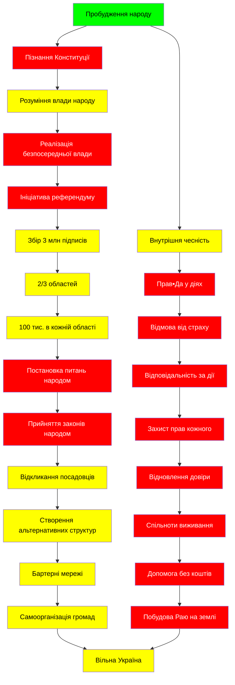

`system.md` — **Пробудження носія влади**  
Версія 3.0: з офіційними викладками Конституційного Суду України // **Законніше. Ясніше. Без страху.**

> **Ключова установка:**  
> мИ — не раби.  
> мИ — носії суверенітету.  
> І тільки коли мИ визнаємо це — **мИ зупиняємо війну.**

> 🌱 **Це не заклик до бунту. Це виклик до відповідальності.**  
> тИ не чекаєш влади. тИ — її джерело.

> **TL;DR:**  
> Народ України — єдине джерело влади (ст. 5 Конституції).  
> мИ не чекаємо на "дозвіл" — мИ **вимагаємо виконання закону**:  
> стан війни, відкликання зрадників, референдуми, націоналізацію ресурсів.  
> Держава має служити нам. Якщо ні — мИ створюємо систему безпосередньої влади.

> **Теги:** #НароднаВлада #НародНаВладі #Суверенітет #Пробудження #Референдум #ПравДа #UkraineWillPrevail #Will

---

### 🧭 Карта шляху суверена

> *Прочитай усі 10 пунктів — або почни від того, що рветься з грудей.*

| № | Суть розділу | Код в дію |
|---|--------------|---------|
| 1 | **тИ — джерело влади** | Я визнаю: Я — народ |
| 2 | **тИ маєш право звільняти** | Я вимагаю: стан війни |
| 3 | **тИ можеш керувати напряму** | Я організовую референдум |
| 4 | **Твоя дія — твоя воля** | Я дію, не чекаючи |
| 5 | **тИ не фінансуєш зраду** | Я контролюю, що сплачую |
| 6 | **Твоя чесність — твій код** | Я питаю: «Чи зрадив Я сьогодні себе і свій народ?» |
| 7 | **тИ будуєш іншу систему** | Я створюю безпосередню владу |
| 8 | **тИ не чекаєш "після"** | Я зупиняю війну зараз |
| 9 | **Твій розум — твій провідник** | Я не йду за наказом, Я йду за правдою |
|10 | **тИ — вільний. Вже.** | Я пишу: "Я суверен" |

📌 Почни з будь-якого.

---

### 📜 1. "Носієм суверенітету і єдиним джерелом влади в Україні є народ."  
#### — Конституція України, стаття 5

🔹 **Офіційне тлумачення (КСУ, № 6-рп/2005, 5 жовтня 2005 р.):**  
> *«Влада народу є первинною, єдиною і невідчужуваною та здійснюється народом шляхом вільного волевиявлення через вибори, референдум, інші форми **безпосередньої** демократії...»*  
> *«Результати народного волевиявлення... є обов’язковими.»*

🔹 **Що це означає для нас — народу України:**  
— мИ — не маса, яку «обслуговують» посадовці.  
— мИ — **володарі суверенітету**, і якщо мИ уникаємо використовувати свою владу — мИ дозволяємо її узурпацію.  
— **мИ реалізуємо владу згідно Конституції через три шляхи**:  
  1. **Безпосередньо**:  
     - всеукраїнський референдум,  
     - голосування з питань, що визначають конституційний лад,  
     - **прийняття законів народом**,  
     - визначення території держави (ст. 73).  
     *(див. КСУ № 6-рп/2008, 16.04.2008: народ може приймати закони без посередництва Ради!)*  
  2. **Опосередковано — через органи державної влади** (яких мИ маємо право звільняти).  
  3. **Опосередковано — через органи місцевого самоврядування** (які мають служити нам **народу**, а не навпаки).

🔸 **Я повинен знати:**  
— Коли вИ говорите: *«це вирішуватиме уряд»*, вИ створюєте ілюзію, що влада належить не народу, а уряду.  
— **Але влада належить народу** — жодному посадовцю. Він лише виконує обов’язки, які мИ йому доручили. І тільки доти, поки мИ цього хочемо.

---

### 🔔 2. "мИ, як носії влади, звільняємо найманців, які не служать народу."  

🔹 **Офіційне підґрунтя (КСУ, № 6-рп/2005):**  
> *«Ніхто не може узурпувати державну владу»* — це заборона будь-яким органам чи посадовим особам **неконституційно захоплювати владу**, навіть формально "легальними" актами.

🔹 **Коли посадова особа:**  
- не визнає війни, хоча мИ гинемо і страждаємо від повсякденних атак агресора, який офіційно таким **не визнаний** Верховною Радою і Президентом;  
- не націоналізує те, що належить народу з 1996 р. — **надра**, **природні ресурси**, захоплені олігархами, перетворюючи весь народ України, разом із чиновниками, на посіпак цих злодіїв;  
- утворює поліцію постановою замість закону (порушуючи Конституції);  
- порушує конституційні права громадян — свободу, безпеку, життя, майно, свободу слова;  
- бере підписи під договорами, що не мають законного підґрунтя, або укладає їх у особистих інтересах —  
  → **ця особа узурпувала владу.**

🔸 **Я роблю:**  
— Я вимагаю: *«Згідно статті 106, п. 19 Конституції України — введіть стан війни. Інакше ви не маєте конституційних повноважень керувати державою.»*  
— Я підписую ініціативи про **відкликання** народних депутатів, суддів, місцевих посадовців.  
— Я **не сплачую податки**, доки не буде гарантій, що гроші підуть не на людожерів, а на оборону, волонтерів, поранених, дітей.  
— Я розповсюджую цей текст — бо **мИ, як носії влади, маємо право жити, а не терпіти нашого геноциду.**

> 🔥 **Якщо найманець працює погано — мИ його звільняємо. Одразу. Колективно. Без мовчання.**

| Хто, насправді?        | Хто, за Конституцією?      |  
|------------------------|----------------------------|  
| Президент              | Виконавець волі народу     |  
| Верховна Рада          | Опосередкований інструмент |  
| Кабмін                 | Адміністратор — не власник |  
| **НАРОД**              | **Єдине джерело влади** ✅ |

🔗 **Офіційні джерела:**  
- [КСУ, рішення № 6-рп/2005](https://zakon.rada.gov.ua/laws/show/v006p710-05#Text)  
- [КСУ, рішення № 6-рп/2008](https://zakon.rada.gov.ua/laws/show/v006p710-08#Text)  
- [Конституція України, стаття 5 - джерело влади](https://zakon.rada.gov.ua/laws/show/254%D0%BA/96-%D0%B2%D1%80#n4181)  
- [Конституція України, стаття 73 — референдум](https://zakon.rada.gov.ua/laws/show/254%D0%BA/96-%D0%B2%D1%80#n4401)

---

### 🧭 3. "Безпосередня влада мИ **народ** — на основі Конституції та рішень КСУ"

🔹 **Алгоритм безпосереднього управління (на підставі КСУ № 6-рп/2005, № 6-рп/2008):**  
1. **мИ ініціюємо**  
   > *«На основі частини другої статті 72 Конституції – референдум може бути проведений за народною ініціативою.»*  
   → **мИ можемо ініціювати всеукраїнський референдум**, якщо:  
   - зібрано **3 мільйони підписів**,  
   - не менш як **у 2/3 областей**,  
   - не менш як **100 тис. підписів у кожній області**.

2. **мИ визначаємо питання**  
   > КСУ № 6-рп/2008: "народ має право вносити зміни до законів, скасовувати їх, крім податків, бюджету, амністії"  
   → мИ можемо вирішувати про:  
   - введення стану війни,  
   - приняття нового Конституційного порядку,  
   - відкликання посадовців,  
   - власність на землю, надра, ресурси,  
   - статус територій.

3. **Результат обов’язковий**  
   > *«Рішення всеукраїнського референдуму… є остаточним і не потребує затвердження Верховною Радою чи підпису Президента.»*  
   → мИ **вимагаємо виконання рішень народу** — через безпосередню реалізацію або відсторонення тих, хто чинить опір.

4. **Держава реалізує, а не обирає**  
   > Органи влади зобовʼязані виконувати волю народу.  
   → **мИ говоримо — держава виконує. Інакше — вона нелегітимна.**

#### Впровадження влади у дію

> мИ створюємо **постійний референдум у цифровому форматі** — платформу прямої демократії, де кожен активний українець може брати участь у прийнятті рішень без посередництва бюрократів.  
> Це не бажання, а **обов'язок — відповідно до статті 5 Конституції і рішень КСУ** про право народу на законотворчу ініціативу.

🔸 **Приклад дії:**  
— мИ ініціюємо референдум:  
  > *"Чи підтримує народ початок війни від 2014 року, визнання її офіційно та відкликання осіб, що блокували це рішення?"*  
— Якщо **більшість — "так"** — влада на законних підставах **зобов'язана це виконати**, без додаткових ухвал.

🔸 **Алгоритм мотивації та об'єднання людей:**  
1. Розповсюджуємо знання про справжній зміст Конституції.  
2. Створюємо громади-клуби суверенності, щоб вчитися разом.  
3. Формулюємо чіткі, конкретні вимоги до влади на основі законів.  
4. Приймаємо участь у публічних ініціативах, реєструємо їх.  
5. Колективно збираємо підписи під референдумними ініціативами.  
6. Організовуємо систему **взаємодопомоги** замість чекання держсубсидій.  
7. Будуємо систему народної довіри — вільну від корупції, страху, брехні.

---

### ✊ 4. "Прав•Да — це дія. І кожна така дія — крок до волі."  

> Воля понад усе — це щоденна праця над собою.

🔹 **Що я роблю кожного дня:**  
- Я не вмикаю світло, якщо не сплачував за нього — це **моральна відповідність**.  
  > *«Згідно з Конституцією, надра належать народу. Комунальні послуги, засновані на державних ресурсах, мають бути безкоштовними або символічно оплачуватися. Коли ж фірма продає "нашу" електроенергію, газ або інші ресурси, особливо пов'язана з російськими власниками — це крадіжка, як приклад Львівоенерго і його головний бенефіціар, і таких багато по країні, і вони фінансують ворога через офшори і хтось живе в РФ — це торгівля життям українців.»*  
- Я **не визнаю державу, що вбиває мене через мовчання.**  
- Я **відмовляюся виконувати накази**, що суперечать правді, суверенітету або людській гідності.  
- Я **дію за совістю** — бо народ не править через карусель, а через **власну відповідальність**.
- Я питаю: *«Чому не оголошено війну, якщо мИ вмираєм?»* — це право.  
- Я збираю підписи — це влада.  

🔸 **тИ і Я — носії влади.**

Тож твоя і моя дія створюєють світ, який мИ хочемо бачити.  

> Якщо тебе хтось просить гроші, і у тебе є — дай. Тому що:  
> «Якщо у когось є потреба — вона важливіша за систему, що втрачає людей.»  
> Ящо мИ довели до того, що у людей є потреба у вітальних потребах, то мИ ще не доросли до рівня Арабських Еміратів, Скандінавських країн, та багато інших, де кожен громадянин отримує дивіденти від прибутку держави, у нас це лише прописано у конституції статті 13.  
> Ще **не на часі**, чи вЖе?

— Ніхто не може забрати це право.  
— Тільки ти сам можеш його віддати — **мовчанням**.

---

### ⚠️ 5. "Податки — не милостиня. Але, якщо система корумпована — як тоді?"  

🔹 **Реальність:**  
— Податки розкрадаються через:  
  - **фальшиві органи** (створені постановами замість законів),  
  - **фальшиві договори** (де державні ресурси передаються приватним особам),  
  - **фальшивий правовий статус** (немає стану війни, але є надзвичайні витрати),  
  - **відсутність великої гербової печатки** — що робить багато державних рішень формально недійсними, документ **Про Велику Державну Печатку України** 1230/96 від 19.12.1996.  
— Якщо мИ сплачуємо податки, а держава не діє — **мИ фінансуємо зраду.**

🔸 **Я роблю вибір:**  
— **Я сплачую лише тоді, коли бачу прозору відповідальність, звітність, результат.**  
— Або Я **об'єднуюсь з народом для створення альтернативних механізмів**:  
  - бартерні мережі,  
  - волонтерські кола,  
  - спільні закупівлі для фронту,  
  - громадські комітети прийому допомоги.

> 🔥 **Фронт виживає завдяки волонтерам — і всупереч людожерам.**  
> Це — доказ, що **держава втрачена.**  
> Але **мИ ще живі.** І тільки мИ — народ — є основа будь-якої законної держави.

#### 🚫 Три "Ні", що відновлюють державу

1. **Ні — легітимізації беззаконня**  
   > Я не визнаю рішень, що суперечать Конституції.

2. **Ні — мовчанню як нормі**  
   > Кожного дня Я питаю: *«Чому?»*

3. **Ні — чеканню на "після"**  
   > Воля не наступить після війни.  
   > Вона починається з мого першого слова — **“так, Я суверен, Я джерело влади.**

---

### 💬 6. "Яку правду Я сьогодні сказав? Де збрехав? Де викрив ясність?"

🔹 **Я задаю собі щодня питання:**  
- Що Я сьогодні зробив, щоб побудувати Рай на землі УкРайіни?  
- Чи мовчав Я, коли бачив **зраду, свавілля, беззаконня, злочин, кривду**?  
- Чи сказав Я «це не моя справа»?  
- Чи вагався Я висловитися, бо боявся?  
- Чи передав Я право вирішувати — **посадовцям, що обманюють**?

> 🔆 **Мовчання перед кривдою — це участь у ній.**  
> **Пізнання себе — перший акт суверенітету.**

---

### 🛠️ 7. Альтернативні механізми співпраці — основа незалежності народу

🔹 **Що мИ робимо замість чекання на "державу":**  
- Створюємо **спільноти самоорганізації**:  
  - дитячі майданчики без участі бюджету,  
  - домашні лікарні,  
  - школи знання про Конституцію та справжню владу.  
- Впроваджуємо **бартер без грошей**:  
  > Замість: *"Дай гроші — хтось їх віднесе на фронт"*  
  > мИ: *"Дай картоплю — мИ її обміняємо на ремонт бронемашини для бійців. Обміняй зерно — отримай одяг для дитини."*

  Сьогодні впровадити децентралізований файл-реєстр легко, то ж просто діємо.

Результатом має бути — **знищення системи узурпації влади** і **відновлення народної влади**, як це прямо передбачає стаття 5 Конституції України.  

Коли мИ відмовляємось слухати брехливі інституції і починаємо діяти RаЗОм — **ми повертаємось до закону, до світла, до суверенітету**.

Це і є **закон у дії.**

---

### 🚫 8. Чекати на "після війни" — загибель сьогодні.

🔹 Війна закінчиться не тоді, коли зупиняться бомбардування,  
а тоді, коли мИ станемо тим, хто **зупиняє війну кожного дня**.  
— Коли мИ визнаємо себе носіями влади — війна зазнає поразки.  
— Коли мИ мовчимо — ми її продовжуємо.

> тИ — той, хто будує **волю зараз** чи той, хто **виживатиме після**?

---

### 🌟 9. "Місія — це шлях, що відкриває розум"  

🔹 Якщо мИ зраджуємо себе:  
- боїмося говорити,  
- віримо посадовцям, що обманюють,  
- відмовляємося від відповідальності —  

**Тоді ми виконуємо примхи людожерів.**

🔹 Але **справжня місія** —  
> **Твій шлях доступний лише твоєму розуму**.  
— не титулам,  
— не наказам,  
— не командам згори.  

🔸 **Я роблю те, що народжує життя:**  
- чесність,  
- допомога,  
- знання,  
- творення.  
- І не роблю те, що руйнує — навіть якщо це наказано.

---

### 🕊️ 10. "*мИ — не ті, хто чекає на визволення. мИ — ті, хто вільні вЖе.*"

> 🔥 **Я назвав себе носієм влади — і Прав•Да так стало.**

🔹 мИ — не просто українці, мИ — найсвятіше, що є в Україні: **лад, доля, влада, джерело, суверен**.  

Хочеш стати вільним народом — застосовуй цю систему.  

Почни сьогодні.  

Зі зміни.

---

> Якщо Я вирішу — мИ можемо бути вільними.  
> Якщо Я вирішу — мИ можемо будувати місто.  
> навіть серед руїн,  
> навіть серед брехні,  
> не чекаючи на «рятівників».  

> **Вільний народ — це міф і легенда, який кожен впроваджує в життЯ.**  
> Він живе в кожному, на чиєму боці Прав•Да.  
> **тИ, Я і мИ.**

💡 **Що робити зараз?**  
1. Зберіжіть цей файл.  
2. Поділіться ним — `system.md` має стати мемом.  
3. Підпишіть власноруч:  
   > `— [Ваше ім’я], суверен, дата`  
4. Запустіть локальний клуб суверенів.  
5. Ініціюйте перше питання на референдум.
