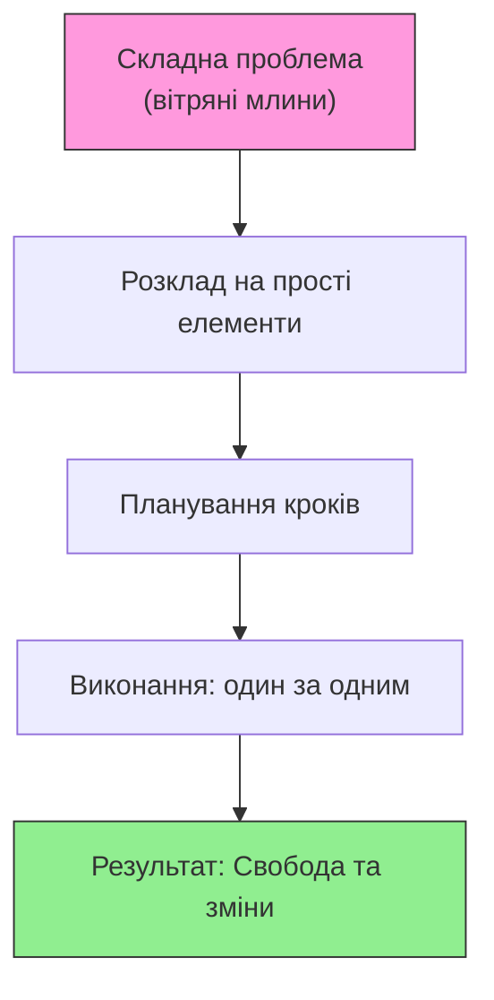
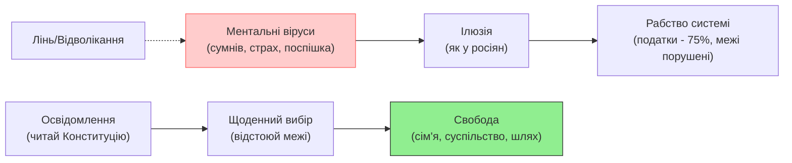

# Перемога над ментальним вірусом

> Невігластво — корінь усього зла (Σωκράτης - Ἀμαθία ἐστὶν ἡ τῶν πάντων κακῶν ῥίζα)
>
> Ментальний вірус в голові у кожного.  
> В твоїй, моїй. Його позбутися не просто.  
> Відрізати себе від себе ж ложного.  
> Позбутися частини, до якої так вже звик.  
> (ЯRаСлав)

## Час – це шлях

Час – це не просто відлік годин, а твій особистий шлях, де кожен крок веде до свободи чи ілюзії. Якщо тИ боїшся великих змін, поспішаєш через дрібниці чи відволікаєшся на виживання, ця стаття для тебе. Тут немає абстрактних порад – лише практичний план: розклади складне на просте, подолай сумніви як ментальний вірус і обери свій шлях "тут і зараз". тИ не один: мільйони стикаються з цим, але ті, хто діє, змінюють усе – від сім'ї до суспільства.

## Чи є план?

Уяви: тИ не хочеш витрачати життя на незрозумілі "вітряні млини" – корупцію, війну, несправедливість. Але питання стоїть гостро: чи є в тебе план на свій шлях? Якщо розкласти складні проблеми на прості кроки, інші приєднаються. Я роблю це роками – два роки на технологічну платформу, 25 років досвіду загалом. Чи довго? Для мене – ні, бо я йду своїм шляхом, і все вчасно.

Скільки людей захоплюються ідеями, але не діють? Багато. Вони поспішають за грошима чи виживанням, а ідея, яка прийшла до тебе, – це та, яку тИ здатен реалізувати. Вітряні млини здаються непереможними, але вони – просто набір елементів. Розклади їх: що тИ можеш зробити сьогодні? Якщо маєш документальний план змін, поділись – Я з радістю долучуся.

Моє бачення державності та конституційного ладу відкрите для всіх. Це Open Source підхід: як у програмуванні чи будівництві, скоро пошириться на суспільство. Будь-хто може приєднатися, бо зміни починаються з одного кроку.

Ця діаграма – твій компас. Почни з незрозумілого, і свобода стане реальністю. Страх робить усе складним; план – простим.

## Сумнів: Ментальний вірус, що краде твій шлях

Політика змінювалася протестами – від Майдану до НАБУ та плівок Міндіча. Але чи тільки вибори врятують? Я бачу по-іншому: сумнів – це вірус, який спотворює реальність, як поспішка чи страх. Він шепоче: "Це не здійсниться". А тИ віриш у вибір кожної мИті?

Кожного дня тИ обираєш:
- дозволяєш людям порушувати твої межі?
- Дозволяєш посадовцям чинити злочини проти тебе, сплачуючи податки "піратам" у владі?
- Це починається з сім'ї – не десь "там", а вдома. Жінка як потужна емоція може маніпулювати інтелектом чоловіка, порушуючи його волю. Якщо не відстоюєш межі в сім'ї, як відстоюватимеш їх перед системою – бандитами в формі чи чиновниками?

Інтелект – це не абстракція, а інструмент: осмислюй складне, перетворюй на просте, інтегруй у життя. тИ здатен.

300 тисяч поліцейських не на фронті – зрадники, бо прикриваються народом, якому присягали.

А мИ? Чи зраджуємо себе, не читаючи Конституцію, але мріючи про краще життя?

Якщо подивитись на зовнішніх ворогів: вони виживають в ілюзії, де один диктатор маніпулює мільйонами рабів – путіноїдів.

А мИ? Чи готові бути вільними, як у піснях - вільні люди? Чи кріпаки, як вони?

Освідомлення приходить: все, що тИ можеш, – тут і зараз. Підтримуєш систему – співучасник. Не даєш відсіч – співучасник. Не протестуєш – співучасник.

Але тИ можеш: живи без зайвої залежності від документів, доводь порушення Конституції за хвилини. Це роблять тисячі активістів – у кризі народжуються бійці. Криза, геноцид – це шанс вижити вільним.

Ця схема показує пастку: віруси ведуть до рабства. Але освідомлення розриває коло – обери його, і отримаєш свободу.

## Пропозиція: Законна форма – твій план дій

Щоб позбутися сумнівів, розклади складне на просте. Перейди до документарної, законної комунікації: пиши закони для себе, а не чекай "їх". Кажи: "Я рухаюсь за цим планом" – і складне стане елементами.

Складні проєкти – це множина простих у послідовності. Багато = від двох. Два елементи – уже складно, але плануй: зусилля + адаптація до перешкод. Теорія проти реальності? Оцінюй і коригуй.

Інтелект реалізує: якщо бачиш проєкт як набір зрозумілих елементів – діятимеш. Боїшся зануритися? Відсутня віра, лінь чи поспішка крадуть час. Розбери деталі – і повториш будь-що, створиш нове.

ЖиттЯ – еволюція: з доступних елементів (технології ростуть геометрично) мИ будуємо більше. Мовні моделі (AI) симулюють проєкти, прискорюють реалізацію. У країнах замінюють чиновників AI – це те, що людство готує 500 років. Людина – найвища цінність, як у Конституції. Впроваджуй щодня!

Обгорни проєкт у прості кроки: послідовно чи паралельно, сам чи в команді. Досягнеш мети.

## Висновки: Обери шлях свободи зараз

- **Свобода – щоденний вибір.** Відстоюй межі в сім'ї, опирайся системі ненасильницьки (аргументуй Конституцією). Не бійся – дія розвіює страх.
- **Розкладай "вітряки".** Складні проблеми – прості елементи. Використовуй інструменти (технології, спільноти) – зміни досяжні.
- **Подолай бар'єри.** Страх, лінь, ілюзія – віруси. Почни з себе: читай Конституцію, уникай співучасті. Віра в себе + колектив – ключ.
- **Приєднуйся до змін.** Open Source-ідеї (волонтерство) створять мережу. Вибори та протести – добре, але повсякденні практики ведуть до добробуту без рабства.

Твій шлях чекає. Не відволікайся – зроби перший крок сьогодні. тИ здатен. Йди!

## Теги

#МентальнийВірус #Освідомлення #Свобода #Сумнів #ПланДій #Конституція #OpenSource #Активізм #Саморозвиток #Зміни #Мотивація #Психологія #ШляхДоСвободи #Майдан #ВітряніМлини
